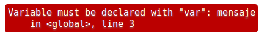
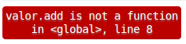

<!-- $theme: default -->
<!-- footer: Taller GEE - MapBiomas - EEA Salta. Noviembre 2017 -->
<!-- page_number: true -->


<br>
Conceptos Básicos de GEE
========================

---
Conceptos Básicos de GEE
========================
En este tutorial vamos a ver los primeros conceptos de GEE y su utilización desde el [Code Editor](https://code.earthengine.google.com/).
Lo que vamos a ver en primer lugar son algunos de los tipos de datos y los principios básicos del módulo **ee.algo**.

---
# Hola Mundo!!
Abrir el [https://code.earthengine.google.com](https://code.earthengine.google.com), preferentemente en Chrome ya que trabaja mejor que en otros navegadores.

Vamos a probar el primer ejemplo de programación en cualquier lenguaje: Hola Mundo!

Vamos a copiar y pegar los ejemplos desde aquí al [Code Editor](https://code.earthengine.google.com/).

```javascript
print('Hola Mundo!');
```
---

# Comentarios: Documentamos nuestro código fuente.
En un lenguaje de programación se llama comentario al texto que no es interpretado por el interprete (valga la redundancia). Estos comentarios ayudan a documentar el código fuente.

```javascript
// Comenté el print usando la doble barra
//print('Hola Mundo!');
```
---

# Tipos de datos básicos de JavaScript: Strings
Variables de tipo textos o cadenas de caracteres, se utilizan las comillas simple o dobles para definir una cadena.

```javascript
// Usamos comillas simples o dobles para crear un string
var saludoString = 'Hola Mundo!!';
print( saludoString );
```
**Importante:** Tenga en cuenta que las variables se definen con la palabra clave **var**. SIEMPRE!!


---
# Tipos de datos básicos de JavaScript: Números
En las variables podemos almacenar números:

```javascript
// Asignamos un número a una variable
var numero = 38;
print('El valor es:', numero);
```

---
# Tipos de datos básicos de JavaScript: Lists

Las listas las definimos con corchetes \[ \].

```javascript
// Lista de números
var listDeNumeros = [0, 1, 1, 2, 3, 5];
print('Lista de Números:', listDeNumeros);
```
Las listas también pueden almacenar strings u otros objetos.

```javascript
// Lista de strings.
var listDeStrings = ['a', 'b', 'c', 'd'];
print('Lista de strings:', listDeStrings);
```
---
# Tipos de datos básicos de JavaScript: Objetos
En JavaScript los objetos son diccionarios de pares **clave: valor**. Para crear un objeto (o diccionario) se utilizan las llaves \{ \}.

```javascript
// Usamos las llaves {} para hacer un diccionario
// de pares clave:valor
var object = {
  foo: 'bar',
  baz: 38,
  stuff: ['Algo', 'eso', 'otro más']
};
print('Diccionario:', object);
// Para acceder al valor de un diccionario se utiliza 
// la clave y los corchetes [ ].
print('Imprime la clave foo:', object['foo']);
// También se puede accider utilizando la notación
// con punto.
print('Print stuff:', object.stuff);
```
---
# Tipos de datos básicos de JavaScript: Funciones

Las funciones son otra forma de mejorar la legibilidad y reutilización del código mediante el agrupamiento de conjuntos de operaciones.
- Defina una función con la palabra clave **function**.
- Los nombres de las funciones comienzan con una letra y tienen un par de paréntesis al final.
- Las funciones a menudo toman parámetros que le dicen a la función qué hacer. Estos parámetros van dentro de los paréntesis ().
- El conjunto de declaraciones que componen la función van dentro de las llaves \{ \}. La palabra clave **return** indica cuál es la salida de la función.

---
# Tipos de datos básicos de JavaScript: Funciones

Hay varias maneras de declarar una función, pero aquí vamos a usar algo como esto:

```javascript
// Ejemplo de cómo se define una función
var funcion_saludo = function( nombre ) {
  var mensaje = '¡Hola ' + nombre + '! ¿Cómo estas?';
  return mensaje;
};

// Invocamos a la función con su parámetro.
print( funcion_saludo( 'Juan' ) );
```

---

# Objetos de GEE

Ahora vamos a aprende cómo colocar primitivas y objetos JavaScript en los contenedores de Earth Engine para enviarlos al servidor y procesarlos en Google.

--- 
#  Objetos de GEE: Strings

Para definir un string, tenemos que agregarla al contenedor **ee.String()** y el contenedor será enviado a Earth Engine. Veamos:

```javascript
// Definimos un string y lo agregamos al contenedor
var unString = 'en la nube';
var eeString = ee.String(unString);
print('Donde estabas? ', eeString);
```

Piense en **ee.algo** como un contenedor para una cosa que existe en el servidor.

```javascript
// Defino una cadena en el servidor.
var serverString = ee.String('Está en el server.');
print('¿Donde está el String?', serverString);
```

Aunque el primer argumento para **print()** es sólo una cadena en el cliente, el segundo argumento es realmente enviado al servidor para ser evaluado, y luego devuelto.

---

# Objetos de GEE: Números
Utilice **ee.Number()** para crear un objeto número en el servidor. Por ejemplo, utilice el método JavaScript **Math.E**  para crear un valor de la constante en el servidor:

```javascript
// Definimos un número en el servidor
var serverNumber = ee.Number(Math.E);
print('e = ', serverNumber);
```
Los métodos **ee.String()** y **ee.Number()** son constructores. Un constructor tiene sus argumentos (y posiblemente otros parámetros) ponemos estos en un contenedor, y retornamos el contenedor y su contenido como un objeto EE que manipulamos en nuestro código. Un constructor comienza siempre con **ee** y retorna un objeto Earth Engine.

--- 

# Objetos de GEE: Métodos en un objeto EE

Para operar con un objeto de EE vamos a utilizar los métodos que son provistos según la clase de objeto con la que trabajemos. En el caso anterior estábamos utilizando ee.Number(). ¿Cómo hacemos para calcular el logaritmo?

```javascript
// Utilice una función incorporada para realizar una 
// operación en el número.
var logE = serverNumber.log();
print('log(e) = ', logE);
```
---
# Objetos de GEE: Listas

Podemos hacer una lista de JavaScript como un objeto **ee.List** en el servidor, ponemos un literal de JavaScript en un contenedor como con números y cadenas.

```javascript
// Ejemplos de listas, secuencia por extención
var eeList = ee.List([1, 2, 3, 4, 5]);
// Secuencia usando el método del objeto list
var secuencia = ee.List.sequence(1, 5);
print('Secuencia:', secuencia);
```
Podemos recuperar un elemento de la lista con el operador **get**. Recuerde que esta lista solo existe en el servidor, **ee** nos permite acceder a esos objetos solo a través de sus métodos.

```javascript
// Usamos un método de ee.List para recuperar un valor
var valor = secuencia.get(2);
print('Valor en la posición 2:', valor);
```
---
# Objetos de GEE: Casting

A veces, Earth Engine no sabe el tipo de objeto que es retornado por un método. Nosotros sabemos que la variable **valor** en el ejemplo anterior es un objeto numérico. Pero si tratamos de sumarle 3 usando el método **add()** de un **ee.Number**, obtendrá un error así:



Esto es común con la función **get()**, que puede devolver todo tipo de objetos de Earth Engine. Para corregirlo, utilice el constructor **ee.Number** para "castear" el resultado:

```javascript
// Cast el valor retornado por get() a number.
print('Sin error:', ee.Number(valor).add(3));
```
---

# Objetos de GEE: Diccionarios

Podemos crear un diccionario en Earth Engine a partir de un objeto JavaScript, de la misma manera que lo hicimos con String, Number y List. El **ee.Dictionary** es construido desde un objeto JavaScript.

```javascript
// Crear un diccionario en el servidor
var diccionario = ee.Dictionary({
  e: Math.E,
  pi: Math.PI,
  phi: (1 + Math.sqrt(5)) / 2
});

// Recuperar algunos valores desde el diccionario.
print('Euler:', diccionario.get('e'));
print('Pi:', diccionario.get('pi'));
print('Golden ratio:', diccionario.get('phi'));

// Recuperar todas las claves
print('Claves: ', diccionario.keys());
```
---
# Objetos de GEE: Fechas

Los objetos de tipo **ee.Date** nos permiten representar tiempo. Al igual que ocurre con otros tipos de datos no hay que confundir entre **Date** de JavaScript y el **ee.Date** de Earth Engine.

---
# Objetos de GEE: Fechas

Veamos los ejemplos:

```javascript
// Definir una fecha en Earth Engine.
var fecha = ee.Date('2015-12-31');
print('Fecha:', fecha);

// Recuperar la fecha actual usando el método
// Date.now() de JavaScript.
var now = Date.now();
print('Milisegundos desde el 1 de Enero de 1970', now);

// Inicializar el objeto ee.Date
var eeNow = ee.Date(now);
print('Now:', eeNow);
```
Los objetos fechas son muy importantes para filtrar las colecciones, especificamente como argumento del método **filterDate()**.

---

## Bibliografía
-  Introduction to JavaScript for Earth Engine. https://developers.google.com/earth-engine/tutorial_js_01
-  Earth Engine Objects. https://developers.google.com/earth-engine/tutorial_js_02
