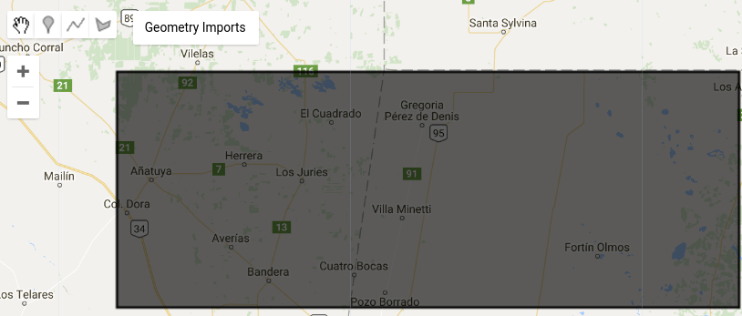
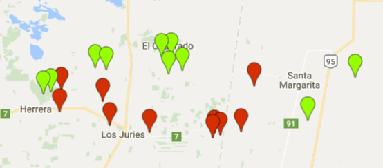

<!-- $theme: default -->
<!-- footer: Taller GEE - MapBiomas - EEA Salta. Noviembre 2017 -->
<!-- page_number: true -->


<br>

Manejo de datos rasters
====

---
# Contenidos
Seleccionar colecciones, filtros por áreas, por fechas y por nubes. Construir máscaras. Visualización. Cómo exportar imágenes (ventajas y limitaciones del servicio). Funciones de agregación. Cálculos de índices. Generación de expresiones. Extracción de información a partir de features (agregación por medias, máximos, mínimos, etc.). Exportar como tabla de datos. Realizar gráficos.

---

# Trabajar con colecciones de imágenes

En la plataforma existe una gran cantidad de fuentes de información entre las que se incluye tanto información de base como imágenes satelitales, bases de datos meteorológicas, como productos generados: Modelos Digitales de Elevación (DEMs), Máscaras de cuerpos de agua y áreas urbanas, etc.

En este caso vamos a seleccionar un producto y lo vamos a filtrar (acotar) a las necesidades particulares (intervalo de tiempo y área de interés), ya que generalmente el alcance es global y se disponen largas series temporales.

---
# ImageCollection ID
Cada producto tiene un código asociado (ImageCollection ID) y una nomenclatura de bandas. 


El buscador del Code Editor permite ver las colecciones disponibles, el ID y las bandas.

---

# Escoger una colección

Seleccionaremos una colección, en este caso: **LANDSAT/LC8\_L1T\_TOA**. El objeto que se utiliza para representar colecciones de imágenes es un [ee.ImageCollection](https://developers.google.com/earth-engine/api_docs#eeimagecollection).

```javascript
// Seleccionar producto. Indicar el ImageCollection ID
var producto = ee.ImageCollection('LANDSAT/LC8_L1T_TOA');
```

Cada elemento de la colección instanciada en la variable _producto_ es a su vez un objeto de tipo [ee.Image](https://developers.google.com/earth-engine/api_docs#eeimage).

---

# Filtrar las escenas de interés

A partir de la colección de imágenes instanciada vamos a aplicar diferentes filtros y selecciones.

Recordemos:
 - Los filtros aplican sobre metadatos, valores de la imagen o utilizando geometrías.
 - Las selecciones aplican sobre las bandas.


---
# Filtrar las escenas de interés

Comenzamos definiendo un área de estudio a partir de un vector para luego poder filtrar por región.

```javascript
// área de estudio (de sección anterior)
var key_area = 'ft:1NOdzgdcCiWZ6YcoEharXG_IYmW03G-ZJeUSZtoOB';
var geometry = ee.FeatureCollection(key_area);
```


---

# Filtrar las escenas de interés

Ahora vamos a aplicar varios filtros:

```javascript
// Filtrar colección
var producto_filtrado = producto
    // Por área de estudio. Debe estar cargada el área
    // en este caso en la variable “geometry”
    .filterBounds( geometry )

    //por rango de fechas
    .filterDate('2016-08-01', '2016-10-31')

    // por cobertura de nubes máxima
    .filterMetadata('CLOUD_COVER','less_than', 40);

```
---
# Mostrar los datos filtrados

En la consola se pueden ver los detalles de la colección filtrada o seleccionada. Para ello hay que invocar a la función **print()** desde el Code Editor:

```javascript
// ver detalles de colección y filtros aplicados
print("Coleccion seleccionada", producto_filtrado);
```

---
# Filtrar Path/Row

Existen otras opciones de filtrado, en el caso de utilizar colecciones LANDSAT podemos utilizar path/row.

- Constructor de filtros [ee.Filter](https://developers.google.com/earth-engine/api_docs#eefilter)

```javascript
producto_filtrado = producto_filtrado 
    // filtrados por Path y Row
    .filter(ee.Filter.eq('WRS_PATH', 227))
    .filter(ee.Filter.eq('WRS_ROW', 79));
```

---
# Seleccionar Bandas

Desde un objeto [ee.Image](https://developers.google.com/earth-engine/api_docs#eeimage) o un [ee.ImageCollection](https://developers.google.com/earth-engine/api_docs#eeimagecollection) es posible seleccionar algunas bandas utilizando el método __select()__.

```javascript
// Definir bandas a seleccionar
var bandas = ['B2','B3','B4','B5','B6','B7']
producto_filtrado = producto_filtrado.select(bandas);
```

Podemos renombrar al seleccionar
```javascript
// Definir bandas a seleccionar
var bandas_a_seleccionar = ['B4','B5']
var nombres_bandas_seleccionadas = ['Red','NIR']

producto_filtrado = producto_filtrado
	.select(bandas_a_seleccionar, 
    		nombres_bandas_seleccionadas);
```

---
# Generar un mosaico

- Dado que una colección (objeto [ee.ImageCollection](https://developers.google.com/earth-engine/api_docs#eeimagecollection)) implica un catálogo, un grupo de imágenes. Para poder generar nuevas bandas, o exportar se requiere convertirla al objeto [ee.Image](https://developers.google.com/earth-engine/api_docs#eeimage). 
- Esto se puede hacer creando una imagen a partir de bandas de la colección o aplicando algoritmos de __reducción__ a la colección (e.g: mediana, promedio o valor máximo de pixels). En este caso, vamos a obtener como resultado una única imágen para cada banda (ahora objeto ee.Image).

```javascript
// Aplicar reducción de mediana
var stack1 = producto_filtrado.median();
```

---
# Visualizar el mosaico
Podemos visualizar la imagen identificando las bandas a mostrar (orden R,G,B), seleccionar los valores máximos y mínimos para ecualizar cada banda y una descripción de la capa. 
Mover el visor hacia el área de estudio para ver la imagen.


```javascript
// ver imagen en mapa:
Map.addLayer( stack1, 
    {bands: ['B5', 'B4', 'B3'], 
     min: [0,0,0], 
     max:[1,1,1] } , 
     "Landsat 8 B5-B4-B3" );

// centrar en area de estudio - indicar nivel de zoom
Map.centerObject( geometry, 8 );
```

---

# Generación de índices

Existen varias formas de generación de índices a partir de bandas:

1.  Por medio de una expresión
2.  Utilizando las funciones básicas de operadores matemáticos aplicados sobre la imagen.
3.  Por medio de una función

---

# Expresiones

Para el cálculo a través de expresiones vamos a requirir la utilización de un __Diccionario__.

```javascript
var bandas_indices = { // Generación de Diccionario
    'NIR': stack1.select('B5'),
    'RED': stack1.select('B4')
};
```

Luego se escribe la expresión que utiliza como variables las claves del diccionario.

```javascript
// cálculo del NDVI usando una expresión
var expresion_ndvi = '(NIR - RED) / (NIR + RED)';
var ndvi = stack1.expression(
	expresion_ndvi, 
	bandas_indices)
	.rename('NDVI');
// ver imagen en mapa:
Map.addLayer(ndvi, { min: [-1], max: [1] }, "NDVI 1" );
```

---

# Realizar operaciones directamente sobre la imagen

```javascript
// cálculo NDVI - operaciones sobre la imagen
var ndvi2 = stack1.select('B5')
	.subtract(stack1.select('B4'))
    	.divide(stack1.select('B5')
        .add(stack1.select('B4')));

// ver imagen en mapa:
Map.addLayer(ndvi2, { min: [-1], max: [1] }, "NDVI 2" );
```
---

# Funciones definidas en la API

En este caso se usa una función de normalización disponible en la plataforma ([normalizedDifference](https://developers.google.com/earth-engine/api_docs#eeimagenormalizeddifference)), indicando las bandas a normalizar:


```javascript
// cálculo NDVI - Por medio de una función
var ndvi3 = stack1.normalizedDifference(['B5', 'B4']);

// ver imagen en mapa:
Map.addLayer (ndvi3, { min: [-1], max: [1] }, "NDVI 3" );
```

---
# Agregar una banda índice al stack

- Agregar índice generado al stack utilizando __addBands__.
- Se recomienda darle un nombre a la nueva banda con la función [rename](https://developers.google.com/earth-engine/api_docs#eeimagerename):

```javascript
// agregar bandas de indices
stack1 = stack1.addBands(ndvi.rename('NDVI'));

// ver imagen en mapa:
Map.addLayer (stack1, {bands: ['NDVI'], min: [-1], max: [1] }, "NDVI" );
```

---
# Desafío

  1. ¿Qué método de los visto para calcular índices considera adecuado implementar este índice?
```
GVI = -0.2941 * Banda2 - 0.243 * Banda3 -0.5424 * Banda4 + 0.7276 * Banda5 + 0.0713 * Banda6 - 0.1608 * Banda7
```
  2. Impleméntelo y agréguelo al mapa.

---

# Visualización de imágenes en mapa

Se puede asignar una escala de colores para bandas únicas (e.g. NDVI) a través de dos métodos:

---
# Utilizando paletas de colores

- La definición de paletas de colores requiere asignar un rango de colores en formato hexadecimal RGB (como vimos en el [picker color](https://www.google.com.ar/#q=picker+color)).

- Podemos usar [ColorBrewer!](http://colorbrewer2.org) :D

```javascript
// Paleta de colores: 5-class RdYlGn
var paleta = 'd7191c,fdae61,ffffbf,a6d96a,1a9641';
Map.addLayer(ndvi3, {min:0, max:0.7 ,palette: paleta},"NDVI 3 con Paleta");
```

---

# Utilizando un SLD

Podemos utilizar un *Style Layer Description* ([SLD](http://www.opengeospatial.org/standards/sld)) para crear una paleta de colores. La misma puede ser generada a mano o con alguna otra imagen desde QGIS u otra herramienta que guarde estilos SLD.

```javascript
// Generar estilo con SLD
var sld_intervals =
  '<RasterSymbolizer>' +
    '<ColorMap  type="intervals" extended="false" >' +
      '<ColorMapEntry color="#0000ff" quantity="0" label="0"/>' +
      '<ColorMapEntry color="#00ff00" quantity="0.1" label="0 - 0.1" />' +
      '<ColorMapEntry color="#007f30" quantity="0.2" label="0.1 - 0.2" />' +
      '<ColorMapEntry color="#30b855" quantity="0.3" label="0.2 - 0.3" />' +
      '<ColorMapEntry color="#ff0000" quantity="0.4" label="0.3 - 0.4" />' +
      '<ColorMapEntry color="#ffff00" quantity="1.0" label="0.4 - 1.0" />' +
    '</ColorMap>' +
  '</RasterSymbolizer>';

Map.addLayer (ndvi3.sldStyle(sld_intervals), {}, "NDVI 3 con SLD" );
```
---

# Exportar imágenes

Permite guardar imágenes o tablas en una carpeta de Google Drive.

Se pueden seleccionar bandas para exportar o exportar todas las bandas.

Puede convenir cambiar el formato de los valores para que ocupe menos espacio. En este caso dado que contiene valores entre -1 y 1 en formato de 4 Bytes por pixel (números con decimales), lo vamos a convertir a número entero (2 bytes por píxel) con un factor de conversión de 10000.

```javascript
// Seleccionamos una sola banda (NDVI) para guardar.
// Cambio de escala (x10.000) y Convierto a entero para que ocupe menos espacio
var stack2 = stack1.select('NDVI')
		.multiply(10000).uint16()
```

---
# Exportar imágenes

Finalmente se debe definir además de la imágen a exportar, el tamaño de píxel (__scale__), una FeatureCollection con el área de estudio (region) y el tamaño máximo de pixeles que puede contener la imagen (maxPixels):


```javascript
// exportar imágen a Google Drive
Export.image.toDrive({
  image:stack2,
  description: 'Landsat_8_NDVI',
  scale: 30,
  region: geometry,
  maxPixels: 1e12
});
```
---
# Extracción de información

Earth engine permite extraer rápidamente información de las imágenes seleccionadas, exportarla o analizarla desde la plataforma a través de sus herramientas de gráficos.

Código generado previamente:

https://code.earthengine.google.com/8f829be89d8584890bb6e4b9cba4ceca

---
# Unificar las muestras

Se deben unificar las distintas clases generadas en un único FeatureCollection llamado __samples__:


```javascript
// Extracción de información
// Unir muestras por clase en un único FeatureCollection    
var samples = clase0;
samples = samples.merge(clase1);

// ver caracteristicas de FeatureCollection
print ("muestras", samples);
```

---
# Extraer valores de la imagen desde los features

- Utilizamos [sampleRegions](https://developers.google.com/earth-engine/api_docs#eeimagesampleregions) para tomar las muestras.
- Desde el __stack__ invocamos el método para muestrear. 
- Los atributos del vector (FeatureCollection) que se desean mantener (atributo “clase”) y la escala (resolución de la imagen):

```javascript
// extraer información:
var training = stack1.sampleRegions({
  collection: samples,
  properties: ['clase',],
  scale: 30
});
```

---
# Exportar el muestreo a CSV
La información obtenida puede ser exportada como CSV:

```javascript
// exportar tabla con información
Export.table.toDrive({
    'collection': training,
    'description': 'muestras_tutorial_1_2',
    'fileNamePrefix': 'muestras_tutorial_1_2',
    'fileFormat': 'CSV'}
);
```
Análisis de información Extraída. La información extraída en formato CSV puede ser analizada por supuesto en otras herramientas: Excel, R, etc. 

---

# Gráficos

Desde la API [ui.Chart](https://developers.google.com/earth-engine/charts) podemos generar algunos gráficos a partir de datos extraídos desde las imágenes.

A continuación se muestra cómo generar un gráfico de tipo XY (“ScatterChart”). Se debe indicar en la función [ui.Chart.feature.groups](https://developers.google.com/earth-engine/charts_feature_groups) el set de datos (“training”), las bandas a graficar (primero la banda que va a eje de las X (“B5”) y luego la banda que va al eje de las Y (“B4”) un atributo de agrupamiento (“clase”). 

Se pueden modificar todos los parámetros del gráfico como: el texto de los ejes y la leyenda.

---
# Scatter plots
```javascript
// Generar Grafico XY. indicar set de datos, banda en eje X, banda en eje Y y grupo

var chart = ui.Chart.feature.groups(training, 'B5', 'B4', 'clase')
      .setChartType('ScatterChart')
      .setOptions({
        hAxis: {title: 'B5'},
        vAxis: {title: 'B4'},
      }).setSeriesNames(["clase 0", "clase 1"]);

// Mostrar el gráfico generado
print(chart);
```
---

# Desafío
Seleccione otras bandas para agregar en el gráfico y analizar, identifique que bandas tienen mayor separabilidad

---
Bibliografía
============

- Baig, M. H. A., Zhang, L., Shuai, T., & Tong, Q. (2014). Derivation of a tasselled cap transformation based on Landsat 8 at-satellite reflectance. Remote Sensing Letters, 5(5), 423-431.
- [Introduction to the Earth Engine JavaScript API](https://developers.google.com/earth-engine/tutorial_api_01)
